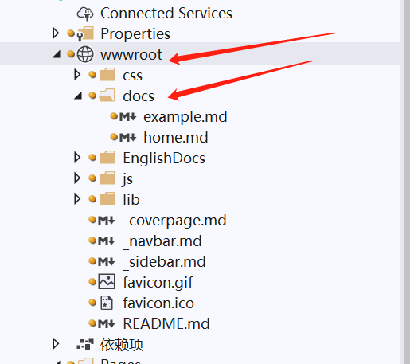
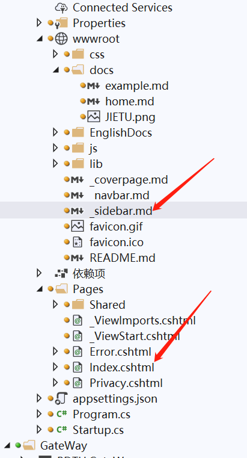

# example
这里是示例教程

# 准备工作
首先，我们需要知道，本文档所采用的格式为md格式，md全称markdown，markdown也是一种标记语言。
markdown标记语言被广泛应用在接口文档中，我们熟知的GitHub，就鼓励用户使用md格式的文档，当你将md格式的文档放在你的代码根目录下时，GitHub会自动根据md文档生成你的GitHub仓库首页。
如果你不会编写md文件，请点击跳转到[markdown](http://www.mdeditor.com/)官网首页，这里有一个在线编辑器可供使用

# 目录结构
当你在md编辑器中编写完接口文档之后，打开文档项目的wwwroot目录，将你写好的文档复制黏贴到docs目录下，无需重启项目即可实时自动生成前端文档界面。

# 文档结构
*文档结构及配置请参考[docsify](https://docsify.js.org/#/zh-cn/quickstart "docsify")官网*

在_sidebar.md中可配置目录结构，在index.cshtml中可配置更多功能属性。

